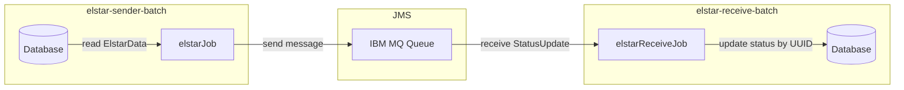
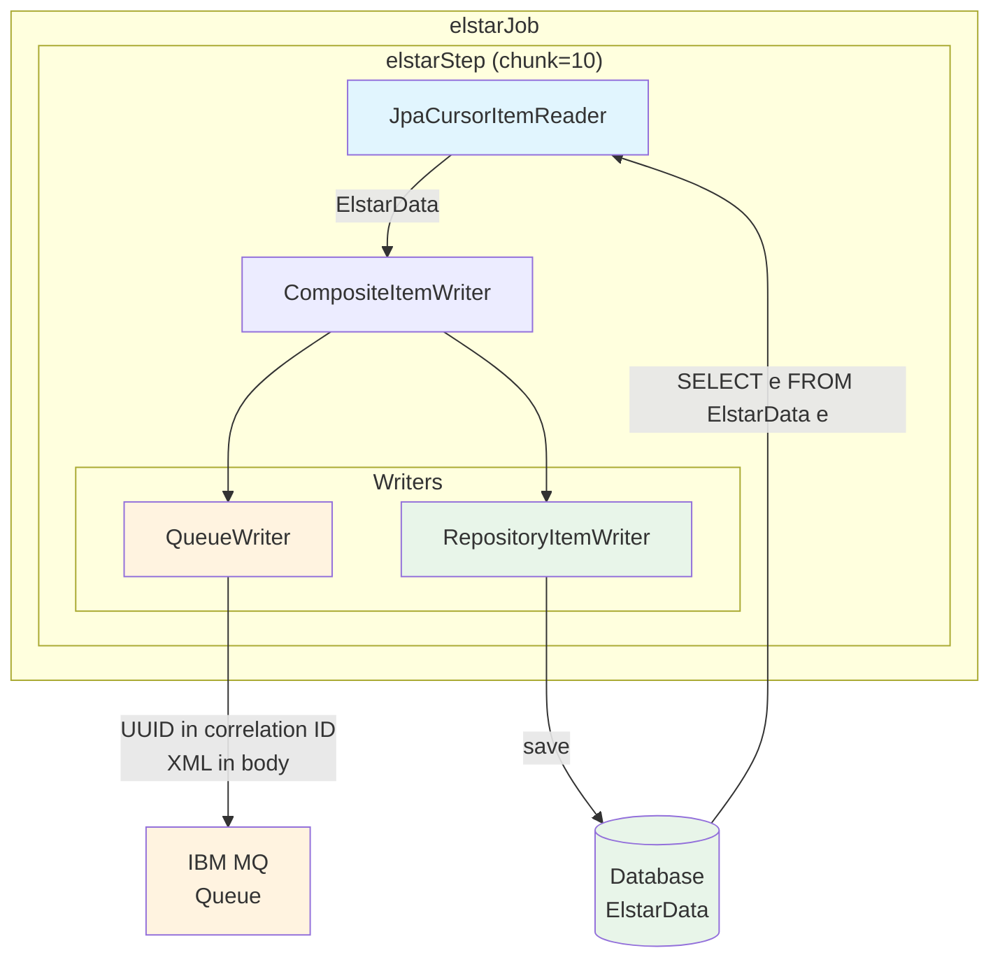
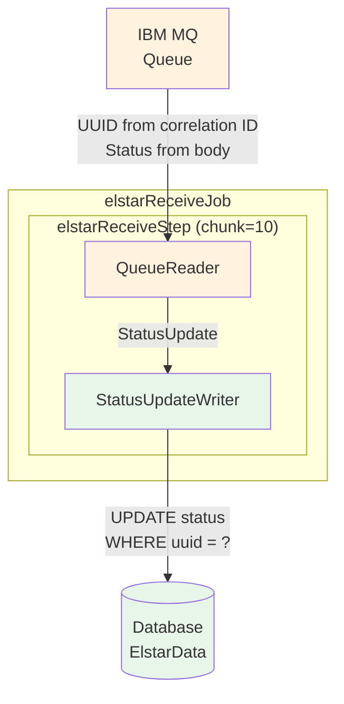
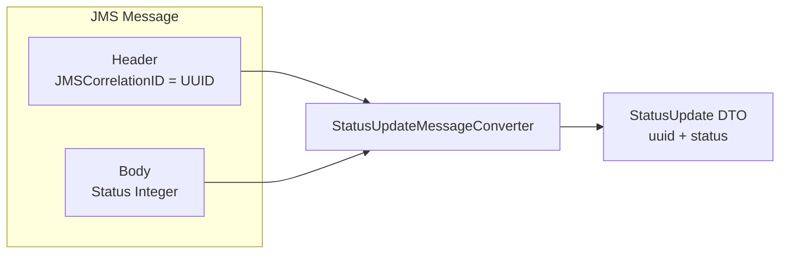

# SpringBoot4Demo

A compact multi-module Maven demo showing how to combine Spring Batch, message queues, and Spring Data repositories in a modular Spring Boot project.

## Purpose
- Demonstrates batch jobs (Spring Batch), asynchronous work via queues (IBM MQ), and persistence with Spring Data repositories.
- Shows a modular structure so components can be developed and tested independently.

## Architecture Overview



## Batch Modules

### elstar-sender-batch

Reads `ElstarData` entities from the database and sends them to a JMS queue.



**Components:**
- **JpaCursorItemReader**: Reads all `ElstarData` entities from the database
- **CompositeItemWriter**: Delegates to multiple writers
  - **QueueWriter**: Sends entity to JMS queue (UUID as correlation ID)
  - **RepositoryItemWriter**: Persists entity back to database

---

### elstar-receive-batch

Reads status update messages from a JMS queue and updates corresponding entities in the database.



**Components:**
- **QueueReader**: Reads `StatusUpdate` messages from JMS queue
  - UUID extracted from JMS correlation ID
  - Status extracted from message body
- **StatusUpdateWriter**: Updates `ElstarData.status` in database by UUID

---

## Message Format



## Quick Start

**Prerequisites:** JDK 17+, Maven, Docker (for IBM MQ Testcontainer)

1. Clone: `git clone https://github.com/mlachat/SpringBoot4Demo.git`
2. Build: `mvn clean install`
3. Run sender: `mvn -pl elstar-sender-batch spring-boot:run`
4. Run receiver: `mvn -pl elstar-receive-batch spring-boot:run`

## Testing

Integration tests use Testcontainers with IBM MQ:

```bash
# Run all tests
mvn test

# Run specific module tests
mvn test -pl elstar-sender-batch
mvn test -pl elstar-receive-batch
```

## Notes
- Configure DB and broker in `application.yml` / `application-{profile}.yml`
- Use JobParameters for job uniqueness
- Tests use H2 database and IBM MQ Testcontainer

## License
This project is released under the MIT License — see LICENSE for details.